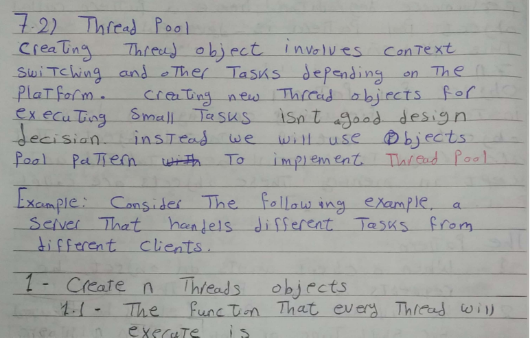
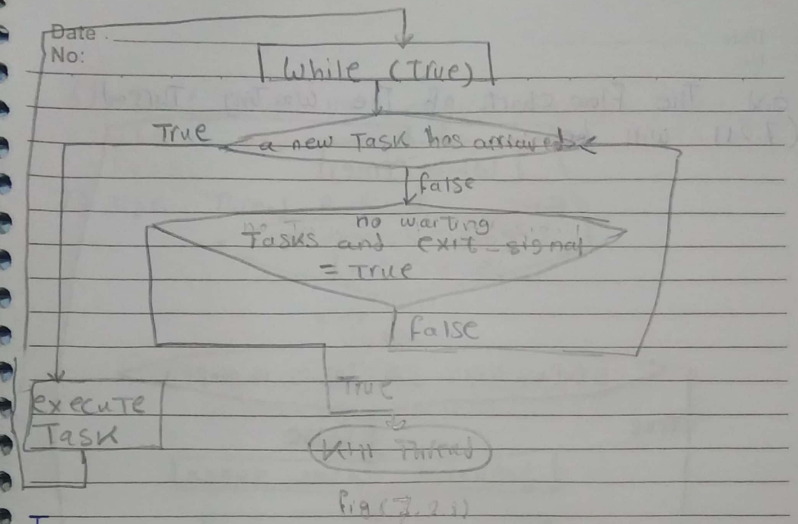
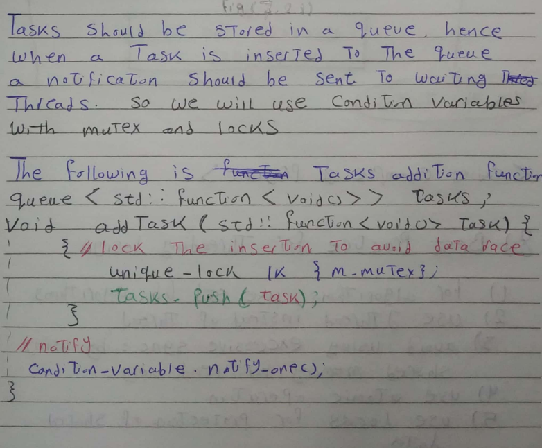
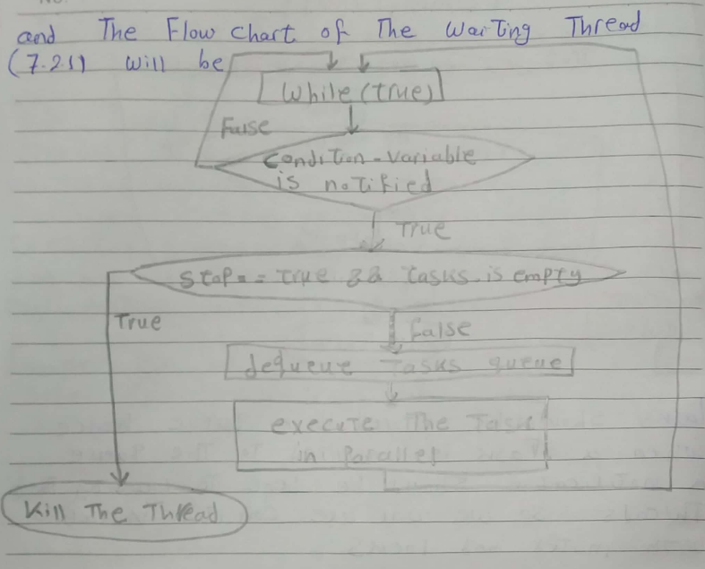

# Thread Pool
This module implements the Pool Object Pattern to manage multiple threads and tasks. It is part of the Code Examples for Multithreaded Programming with C++, specifically based on Chapter 27 of *the Modern C++ book*. The module is integrated into a larger C++ project, which serves as an HTTP server. The following images are excerpts from the [complete chapter](https://drive.google.com/drive/folders/1TiBu1OhQoD36gtcdjmITu_9HvBfFwRLq?usp=drive_link).

